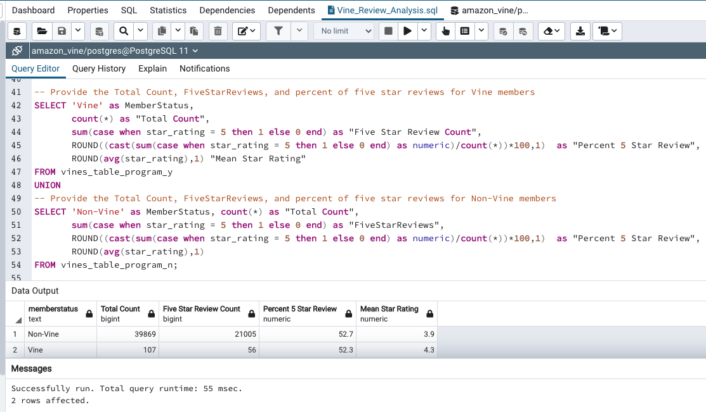

# Amazon_Vine_Analysis

## Overview
For the 16th data analytics project, we analyzed the Amazon Vine program to determine if there was a bias towards favorable reviews for Vine members.  

We used PySpark in Google's Colaboratory website to do our ETL process.  We extracted and transformed the data, connected to an AWS RDS instance hosting a PostgreSQL database and loaded out data into the database to perform our metrics.  We focused on US reviews for the product category Outdoors.

## Resources 

- Data Source: 
    - [Amazon Review dataset list](https://s3.amazonaws.com/amazon-reviews-pds/tsv/index.txt) 
        - [Outdoors Review dataset](https://s3.amazonaws.com/amazon-reviews-pds/tsv/amazon_reviews_us_Outdoors_v1_00.tsv.gz)
- Software: 
    - Google Colab Notebook
    - PostgreSQL 
    - pgAdmin 
    - AWS

# Results
 
___
- Vine Reviews: 107 
- Non-Vine Reviews: 39,869 
___
- Vine 5 Star Reviews: 56
- Non-Vine 5 Star Reviews: 21,005
___
- Vine 5 Star Percentage: 52.3% 
- Non-Vine 5 Star Percentage: 52.7%  
___

# Summary 
52% of the Vine program was 5 star reviews.  The difference between the reviews of Vine and Non-Vine members was only 0.4%.  With that information, there does not seem to be any bias coming from Vine members.  

For additional analysis, we could provide the Mean star rating for both Vine members and Non-Vine members and see if the average rating is higher for Vine members.  This would give a bigger picture since it would tell how the other 48% of the reviewers voted.  
A quick addition to the analysis for average star rating indicates that Vine members have an average of 4.3 stars while Non-Members have an average of 3.9 stars.  Taking into account this metric, it seems that though members may not be more likely to give a 5 star rating, they still give a higher average star rating for this data set.  I would say this indicates that a bias may still exist.  